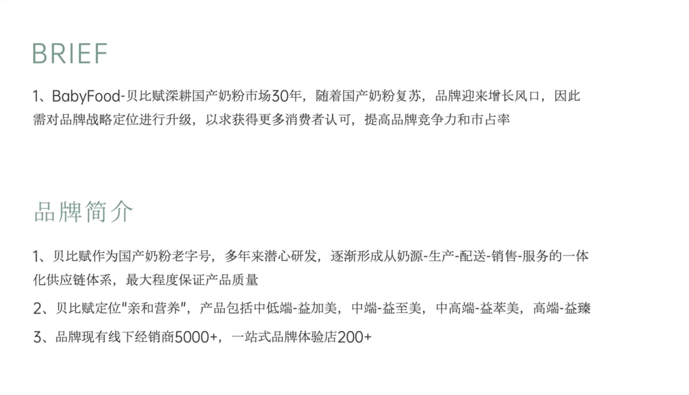

# Slide 1 · BRIEF

## 页面图片

## 图片 OCR 文本

BRIEF
1、BabyFood-贝比赋深耕国产奶粉市场30年，随着国产奶粉复苏，品牌迎来增长风口，因此
需对品牌战略定位进行升级，以求获得更多消费者认可，提高品牌竞争力和市占率
品牌简介
1、贝比赋作为国产奶粉老字号，多年来潜心研发，逐渐形成从奶源-生产-配送-销售-服务的一体
化供应链体系，最大程度保证产品质量
2、贝比赋定位“亲和营养”，产品包括中低端-益加美，中端-益至美，中高端-益萃美，高端-益臻
3、品牌现有线下经销商5000+，一站式品牌体验店200+
