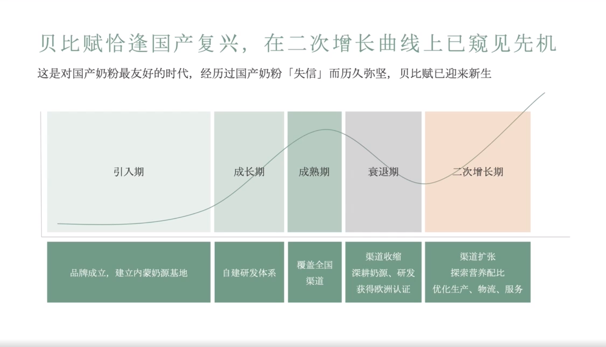

# Slide 5 · 贝比赋恰逢国产复兴，在二次增长曲线上已窥见先机

## 页面图片

## 图片 OCR 文本

贝比赋恰逢国产复兴，在二次增长曲线上已窥见先机
这是对国产奶粉最友好的时代，经历过国产奶粉「失信」而历久弥坚，贝比赋已迎来新生
引入期
成长期
成熟期
衰退期
二次增长期
品牌成立，建立内蒙奶源基地
自建研发体系
覆盖全困
渠道
渠道收缩
深耕奶源、研发
获得欧洲认证
渠道扩张
探索营养配比
优化生产、物流、服务
