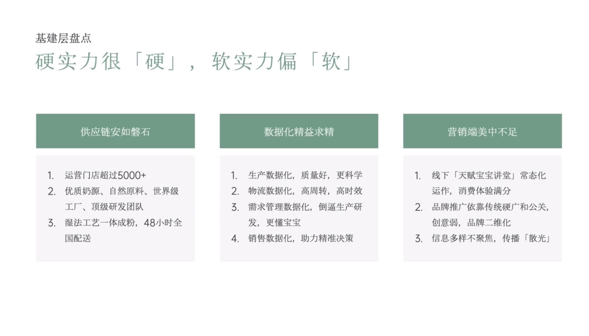

# Slide 8 · 基建层盘点

## 页面图片

## 图片 OCR 文本

基建层盘点
硬实力很「硬」，软实力偏「软」
供应链安如磐石
数据化精益求精
1. 运营门店超过5000+
2. 优质奶源、自然原料、世界级
工厂、顶级研发团队
3. 湿法工艺一体成粉，48小时全
国配送
1. 生产数据化，质量好，更科学
2. 物流数据化，高周转，高时效
3. 需求管理数据化，倒逼生产研
发，更懂宝宝
4. 销售数据化，助力精准决策
营销端美中不足
1. 线下「天赋宝宝讲堂」常态化
运作，消费体验满分
品牌推广依靠传统硬广和公关，
创意弱，品牌二维化
3. 信息多样不聚焦，传播「散光」
