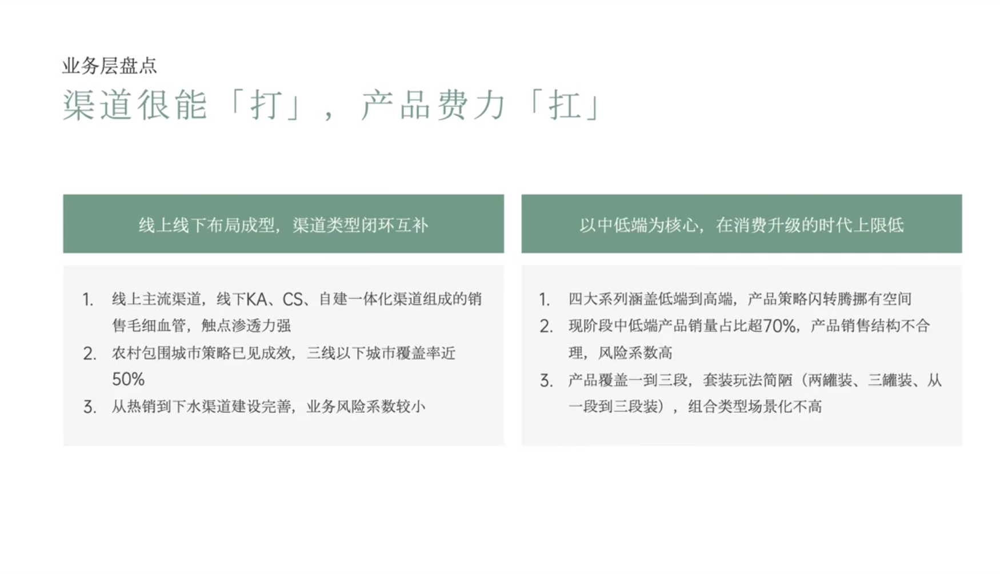

# Slide 9 · 业务层盘点

## 页面图片

## 图片 OCR 文本

业务层盘点
渠道很能「打」，产品费力「扛」
线上线下布局成型，渠道类型闭环互补
以中低端为核心，在消费升级的时代上限低
1. 线上主流渠道，线下KA、CS、自建一体化渠道组成的销
售毛细血管，触点渗透力强
2. 农村包围城市策略已见成效，三线以下城市覆盖率近
50%
3. 从热销到下水渠道建设完善，业务风险系数较小
1. 四大系列涵盖低端到高端，产品策略闪转腾挪有空间
2. 现阶段中低端产品销量占比超70%，产品销售结构不合
理，风险系数高
3. 产品覆盖一到三段，套装玩法简陋（两罐装、三罐装、从
一段到三段装），组合类型场景化不高
