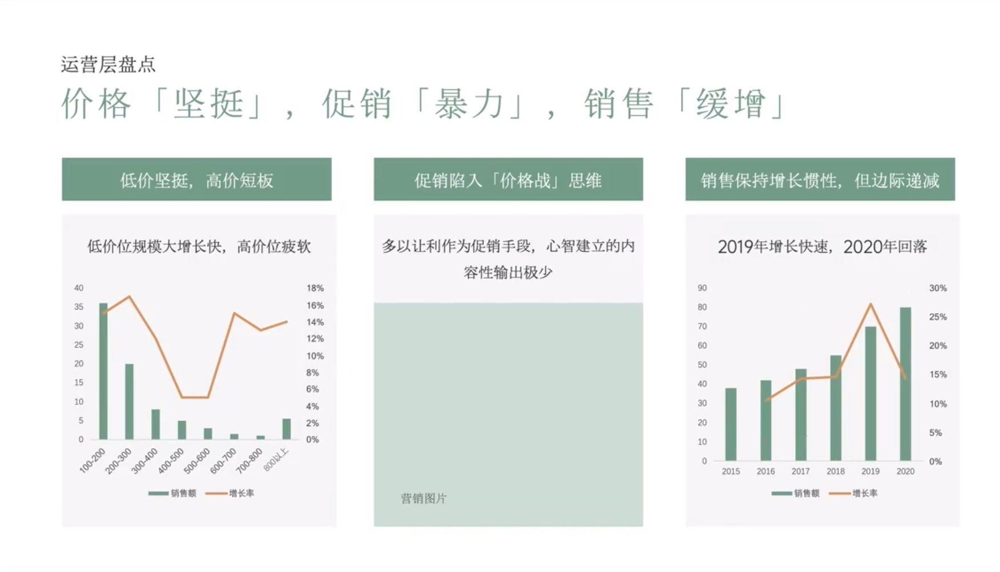

# Slide 10 · 运营层盘点

## 页面图片

## 图片 OCR 文本

运营层盘点
价格「坚挺」，促销「暴力」，销售
「缓增」
低价坚挺，高价短板
促销陷入「价格战」思维
销售保持增长惯性，但边际递减
低价位规模大增长快，高价位疲软
多以让利作为促销手段，心智建立的内
容性输出极少
2019年增长快速，2020年回落
40
35
30
25
20
15
10
18%
16%
14%
12%
10%
8%
6%
4%
2%
0%
90
80
70
60
50
40
30
20
10
30%
^
25%
20%
15%
10%
5%
0%
100-200
200-300
300-400
400-500
500-600
一销售额。
600-700
700-800
—地长率
800以上
2015
2016
2017
一销售额一
2018
2019
—增长率
2020
营销图片
