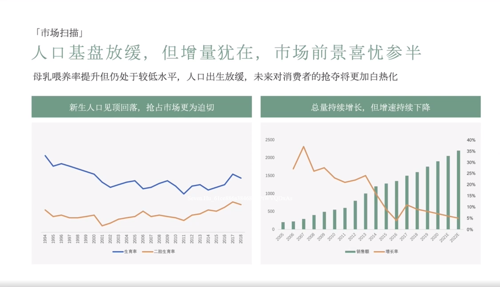

# Slide 15 · 「市场扫描」

## 页面图片

## 图片 OCR 文本

「市场扫描」
人口基盘放缓，但增量犹在，市场前景喜忧参半
母乳喂养率提升但仍处于较低水平，人口出生放缓，未来对消费者的抢夺将更加白热化
新生人口见顶回落，抢占市场更为迫切
总量持续增长，但增速持续下降
2500
2000
1500
1000
500
罾罾罾禽罾罾景募岌罠嗩爲囂复囂員晨茛岌罠嗩晨晨篡囂
生育
宰
二胎生育率
离飞么离离离立么离立离离立的 的心
销售额
-增长串
40%
35%
30%
25%
20%
15%
10%
5%
0%
