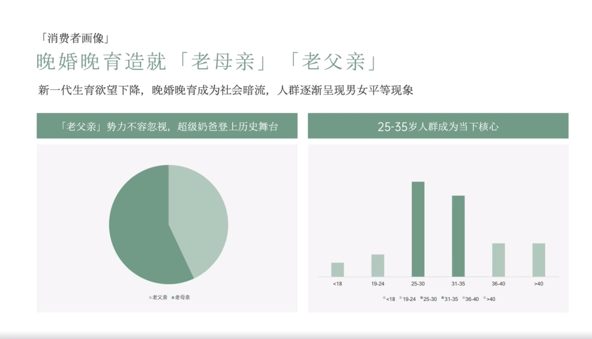

# Slide 25 · 「消费者画像」

## 页面图片

## 图片 OCR 文本

「消费者画像」
晚婚晚育造就「老母亲」「老父亲」
新一代生育欲望下降，晚婚晚育成为社会暗流，人群逐渐呈现男女平等现象
「老父亲」势力不容忽视，超级奶爸登上历史舞台
25-35岁人群成为当下核心
-19
19-24
•老父亲。老母亲
25-30
31-35
•<18 -19.24 25-30
•31-35
•36-40 -40
36-40
340
