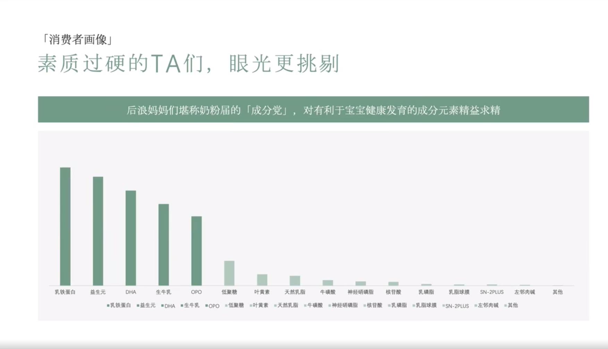

# Slide 27 · 「消费者画像」

## 页面图片

## 图片 OCR 文本

「消费者画像」
素质过硬的TA们，眼光更挑剔
后浪妈妈们堪称奶粉届的「成分党」，对有利于宝宝健康发育的成分元素精益求精
乳铁蛋白
益生元
DHA
生牛乳
OPO
低聚糖
叶黄素
天然乳脂
牛礦酸 神经硝磷脂核苷酸
乳磷脂
乳脂球膜
SN-2PLUS
左邻肉碱
•乳铁蛋白•益生元 •DHA •生牛 •OPO •低聚糖 •叶黄素 •天然乳脂-牛磺酸•神经硝磷脂•核苷酸•乳磷脂-乳脂球膜 -SN-2PLUS •左邻肉碱•其他
其他
