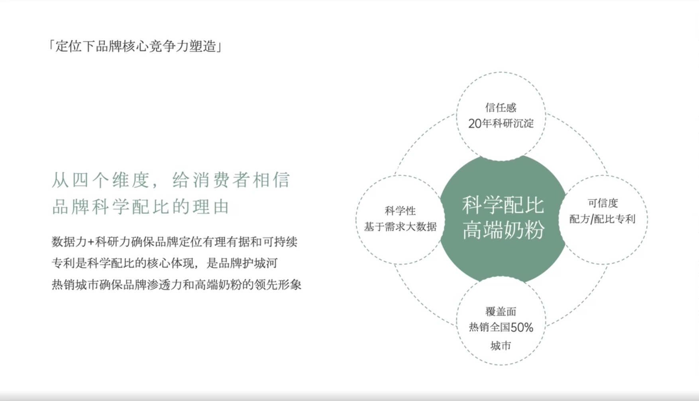

# Slide 47 · 「定位下品牌核心竞争力塑造」

## 页面图片

## 图片 OCR 文本

「定位下品牌核心竞争力塑造」
从四个维度，给消费者相信
品牌科学配比的理由
数据力＋科研力确保品牌定位有理有据和可持续
专利是科学配比的核心体现，是品牌护城河
热销城市确保品牌渗透力和高端奶粉的领先形象
科学性
基于需求大数据
信任感
20年科研沉淀
科学配比
高端奶粉
覆盖面
热销全国50%
城市
可信度
配方/配比专利
