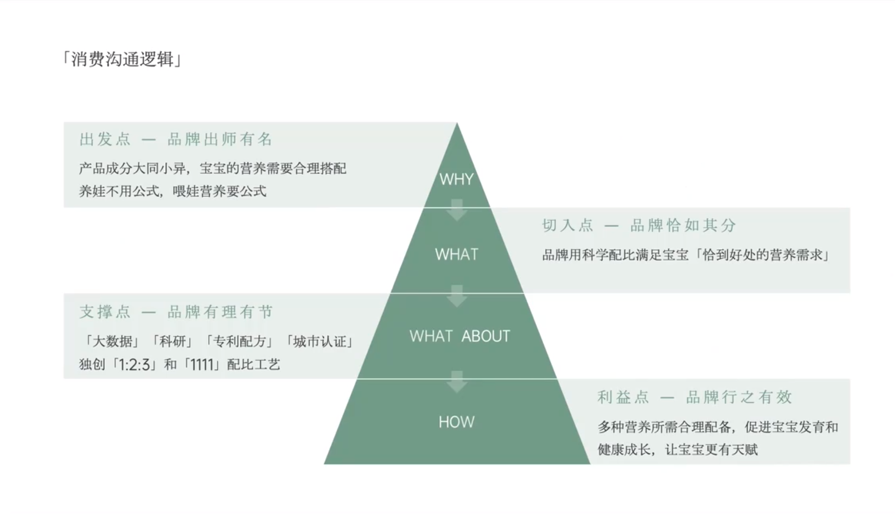

# Slide 48 · 「消费沟通逻辑」

## 页面图片

## 图片 OCR 文本

「消费沟通逻辑」
出发点一品牌出师有名
产品成分大同小异，宝宝的营养需要合理搭配
养娃不用公式，喂娃营养要公式
支撑点一 品牌有理有节
「大数据」「科研」「专利配方」「城市认证」
独创「1:2:3」和「1111」配比工艺
WHY
WHAT
WHAT ABOUT
HOW
切入点一 品牌恰如其分
品牌用科学配比满足宝宝「恰到好处的营养需求」
利益点一品牌行之有效
多种营养所需合理配备，促进宝宝发育和
健康成长，让宝宝更有天赋
