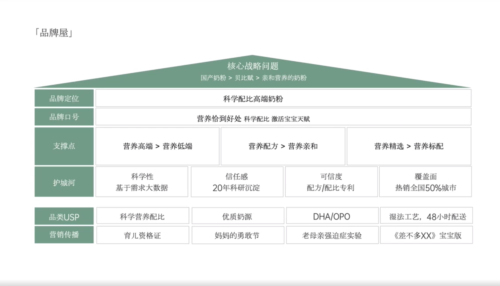

# Slide 79 · 「品牌屋」

## 页面图片

## 图片 OCR 文本

「品牌屋」
品牌定位
品牌口号
支撑点
护城河
品类USP
营销传播
营养高端＞营养低端
科学性
基于需求大数据
科学营养配比
育儿资格证
核心战略问题
国产奶粉＞贝比赋＞亲和营养的奶粉
科学配比高端奶粉
营养恰到好处 科学配比 激活宝宝天赋
营养配方>营养亲和
营养精选＞营养标配
信任感
20年科研沉淀
优质奶源
妈妈的勇敢节
可信度
配方/配比专利
DHA/OPO
老母亲强迫症实验
覆盖面
热销全国50%城市
湿法工艺，48小时配送
《差不多XX》宝宝版
