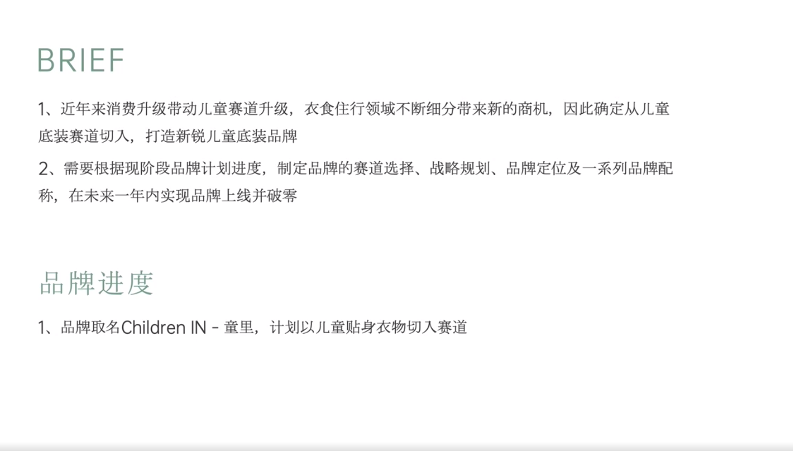

# Slide 1 · BRIEF

## 页面图片

## 图片 OCR 文本

BRIEF
1、近年来消费升级带动儿童赛道升级，衣食住行领域不断细分带来新的商机，因此确定从儿童
底装赛道切入，打造新锐儿童底装品牌
2、需要根据现阶段品牌计划进度，制定品牌的赛道选择、战略规划、品牌定位及一系列品牌配
称，在未来一年内实现品牌上线并破零
品牌进度
1、品牌取名Children IN - 童里，计划以儿童贴身衣物切入赛道
