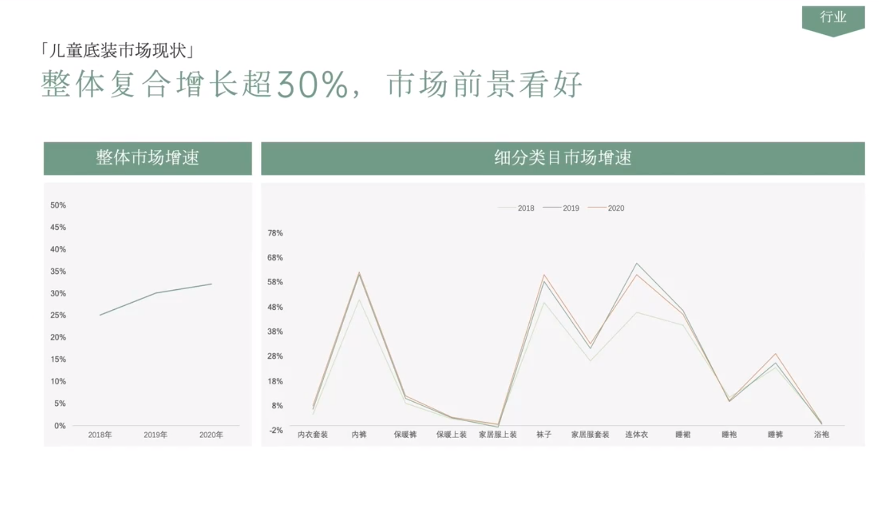

# Slide 10 · 行业

## 页面图片

## 图片 OCR 文本

行业
「儿童底装市场现状」
整体复合增长超30%，市场前景看好
𤨣体市场增速
细分类目市场增速
50%
45%
40%
35%
30%
25%
20%
15%
10%
5%
0%
2018—2019
-2020
2018年
2019年
2020年
78%
68%
58%
48%
38%
28%
18%
8%
-2%
内衣套装 内裤
保暖裤
保暖上装
豪居服上装
袜子
竅居服套装
连体衣
淫裾
隱袍
睡裤
浴袍
