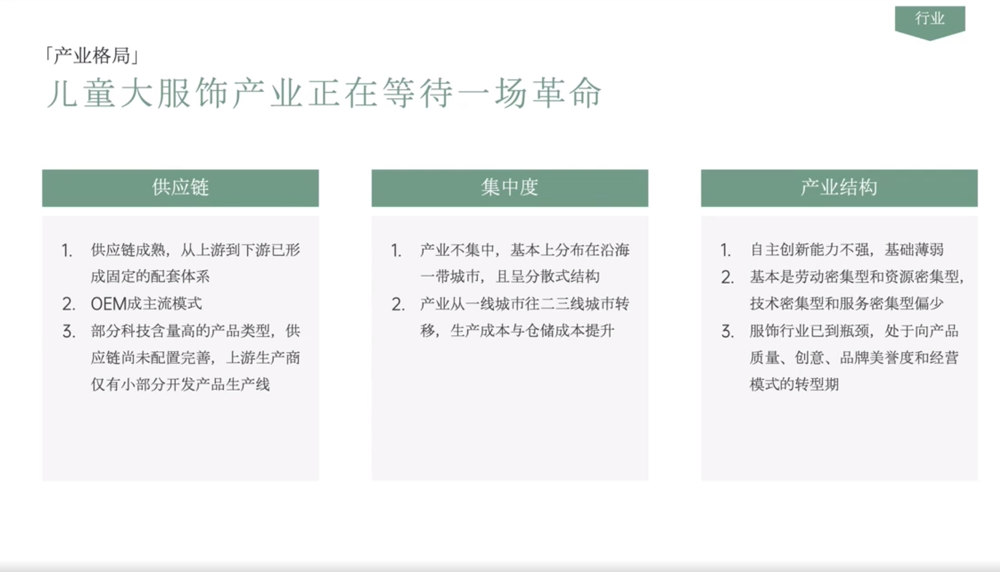

# Slide 12 · 「产业格局」

## 页面图片

## 图片 OCR 文本

「产业格局」
儿童大服饰产业正在等待一场革命
供应链
集中度
1. 供应链成熟，从上游到下游已形
成固定的配套体系
2. OEM成主流模式
3. 部分科技含量高的产品类型，供
应链尚未配置完善，上游生产商
仅有小部分开发产品生产线
1. 产业不集中，基本上分布在沿海
一带城市，且呈分散式结构
2. 产业从一线城市往二三线城市转
移，生产成本与仓储成本提升
行业
产业结构
1. 自主创新能力不强，基础薄弱
2. 基本是劳动密集型和资源密集型，
技术密集型和服务密集型偏少
3. 服饰行业已到瓶颈，处于向产品
质量、创意、品牌美 度和经营
模式的转型期
