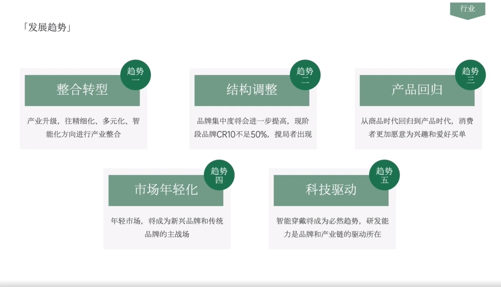

# Slide 14 · 行业

## 页面图片

## 图片 OCR 文本

行业
「发展趋势」
趋势
趋势
趋势
三
整合转型
产业升级，往精细化、多元化、智
能化方向进行产业整合
结构调整
品牌集中度将会进一步提高，现阶
段品牌CR10不是50%，搅局者出现
产品回归
从商品时代回归到产品时代，消费
者更加愿意为兴趣和爱好买单
趋势
四
趋势
五
市场年轻化
年轻市场，将成为新兴品牌和传统
品牌的主战场
科技驱动
智能穿戴将成为必然趋势，研发能
力是品牌和产业链的驱动所在
