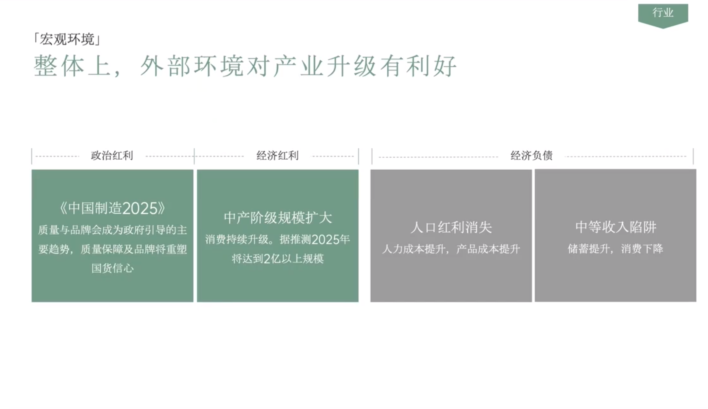

# Slide 15 · 行业

## 页面图片

## 图片 OCR 文本

行业
「宏观环境」
整体上，外部环境对产业升级有利好
政治红利
•经济红利
经济负债
《中国制造2025》
质量与品牌会成为政府引导的主
要趋势，质量保障及品牌将重塑
国货信心
中产阶级规模扩大
消费持续升级。据推测2025年
将达到2亿以上规模
人口红利消失
人力成本提升，产品成本提升
中等收入陷阱
储蓄提升，消费下降
