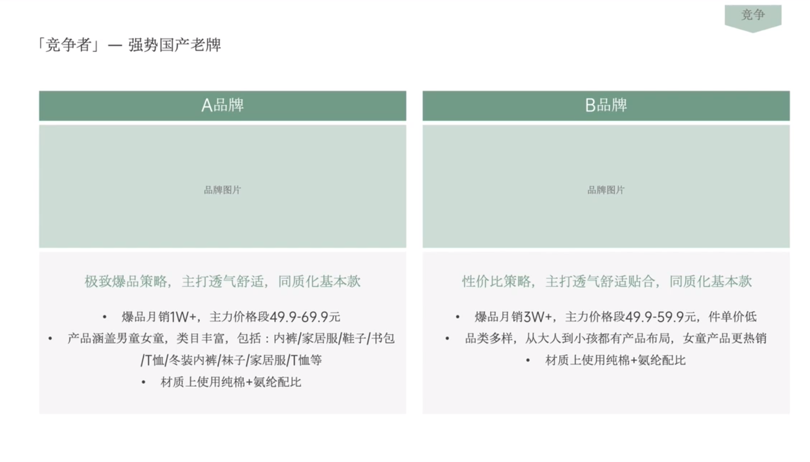

# Slide 17 · 竞争

## 页面图片

## 图片 OCR 文本

竞争
「竞争者」一强势国产老牌
A品牌
B品牌
品牌图片
品牌图片
极致爆品策略，主打透气舒适，同质化基本款
• 爆品月销1W+，主力价格段49.9-69.9元
• 产品涵盖男童女童，类目丰富，包括：内裤/家居服/鞋子/书包
/T恤/冬装内裤/袜子/家居服/T恤等
• 材质上使用纯棉＋氨纶配比
性价比策略，主打透气舒适贴合，同质化基本款
• 爆品月销3W+，主力价格段49.9-59.9元，件单价低
• 品类多样，从大人到小孩都有产品布局，女童产品更热销
• 材质上使用纯棉＋氨纶配比
