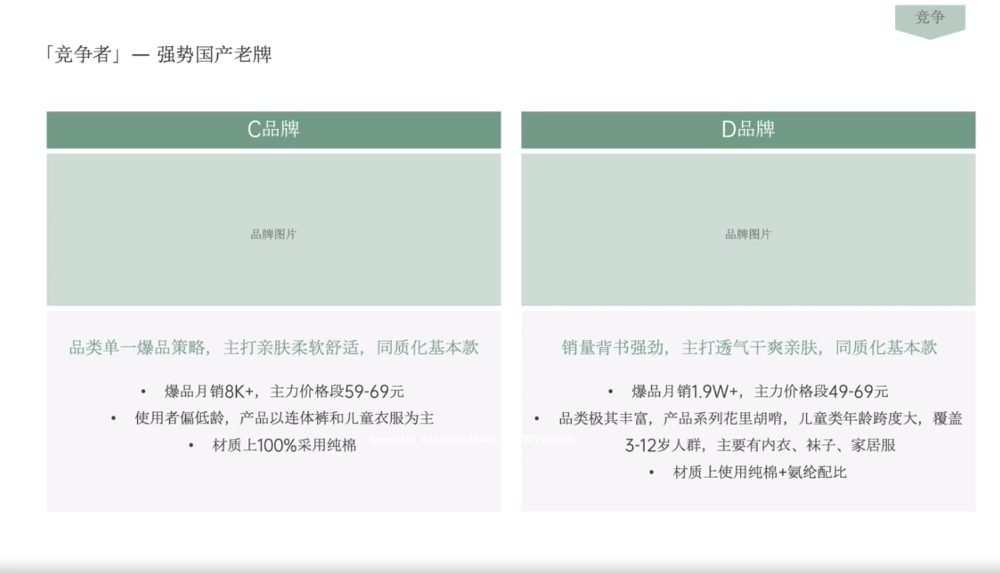

# Slide 18 · 竞争

## 页面图片

## 图片 OCR 文本

竞争
「竞争者」一 强势国产老牌
C品牌
D品牌
品牌图片
品牌图片
品类单一爆品策略，主打亲肤柔软舒适，同质化基本款
• 爆品月销8K+，主力价格段59-69元
• 使用者偏低龄，产品以连体裤和儿童衣服为主
． 材质上100%采用纯棉
销量背书强劲，主打透气干爽亲肤，同质化基本款
• 爆品月销1.9W+，主力价格段49-69元
• 品类极其丰富，产品系列花里胡哨，儿童类年龄跨度大，覆盖
3-12岁人群，主要有内衣、袜子、家居服
• 材质上使用纯棉＋氨纶配比
