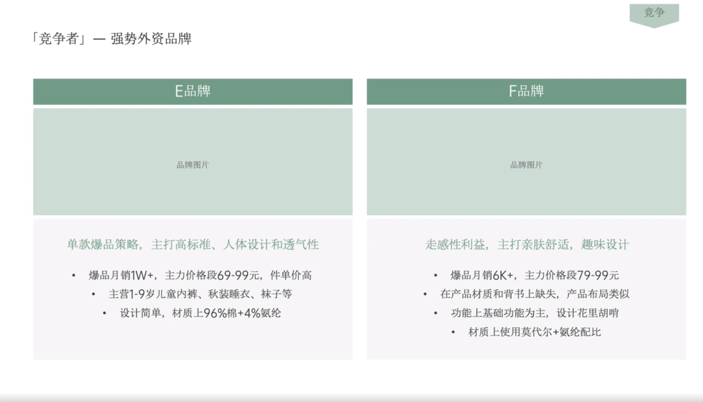

# Slide 19 · 「竞争者」一 强势外资品牌

## 页面图片

## 图片 OCR 文本

「竞争者」一 强势外资品牌
E品牌
品牌图片
单款爆品策略，主打高标准、人体设计和透气性
• 爆品月销1W+，主力价格段69-99元，件单价高
• 主营1-9岁儿童内裤、秋装睡衣、袜子等
• 设计简单，材质上96%棉+4%氨纶
竞争
F品牌
品牌图片
走感性利益，主打亲肤舒适，趣味设计
• 爆品月销6K+，主力价格段79-99元
• 在产品材质和背书上缺失，产品布局类似
• 功能上基础功能为主，设计花里胡哨
• 材质上使用莫代尔+氨纶配比
