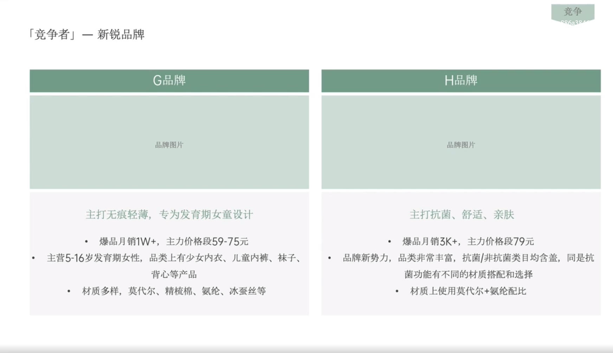

# Slide 20 · 「竞争者」一新锐品牌

## 页面图片

## 图片 OCR 文本

「竞争者」一新锐品牌
G品牌
品牌图片
主打无痕轻薄，专为发育期女童设计
• 爆品月销1W+，主力价格段59-75元
• 主营5-16岁发育期女性，品类上有少女内衣、儿童内裤、袜子、
背心等产品
• 材质多样，莫代尔、精梳棉、氨纶、冰蚕丝等
竞争
∞86a38
H品牌
品牌图片
主打抗菌、舒适、亲肤
• 爆品月销3K+，主力价格段79元
• 品牌新势力，品类非常丰富，抗菌/非抗菌类目均含盖，同是抗
菌功能有不同的材质搭配和选择
． 材质上使用莫代尔+氨纶配比
