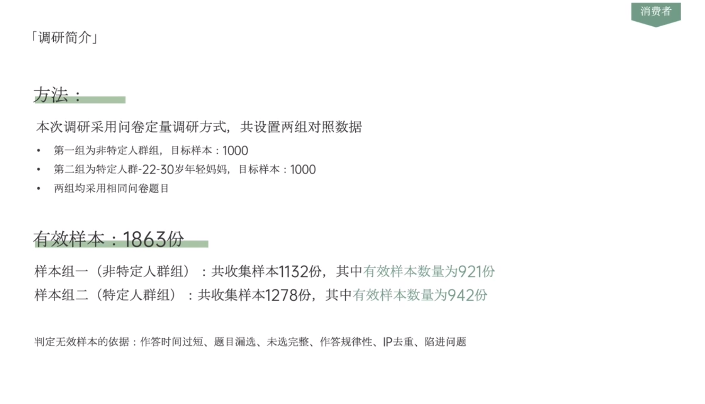

# Slide 23 · 消费者

## 页面图片

## 图片 OCR 文本

消费者
「调研简介」
方法：
本次调研采用问卷定量调研方式，共设置两组对照数据
• 第一组为非特定人群组，目标样本：1000
• 第二组为特定人群-22-30岁年轻妈妈，目标样本：1000
• 两组均采用相同问卷题目
有效样本：1863份
样本组一（非特定人群组）：共收集样本1132份，其中有效样本数量为921份
样本组二（特定人群组）：共收集样本1278份，其中有效样本数量为942份
判定无效样本的依据：作答时间过短、题目漏选、未选完整、作答规律性、IP去重、陷进问题
