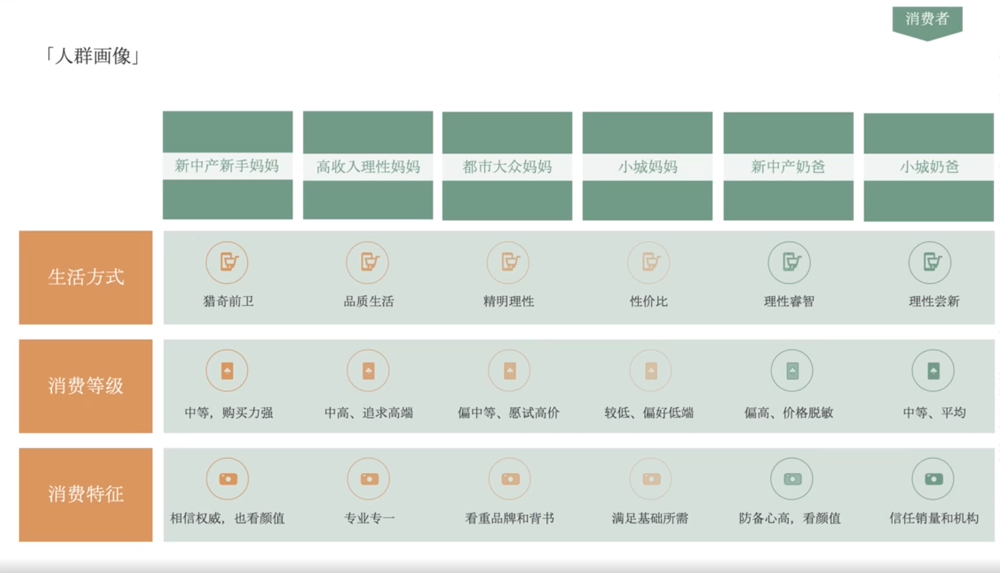

# Slide 24 · 「人群画像」

## 页面图片

## 图片 OCR 文本

「人群画像」
新中产新手妈妈
高收入理性妈妈
生活方式
猎奇前卫
品质生活
消费等级
中等，购头力强
中高、追求高端
消费特征
相信权威，也看颜值
专业专一
都市大众妈妈
精明理性
偏中等、愿试高价
看重品牌和背书
小城妈妈
性价比
较低、偏好低端
满足基础所需
消费者
新中产奶爸
小城奶爸
理性睿智
理性尝新
偏高、价格脱敏
中等、平均
防备心高，看颜值
信任销量和机构
