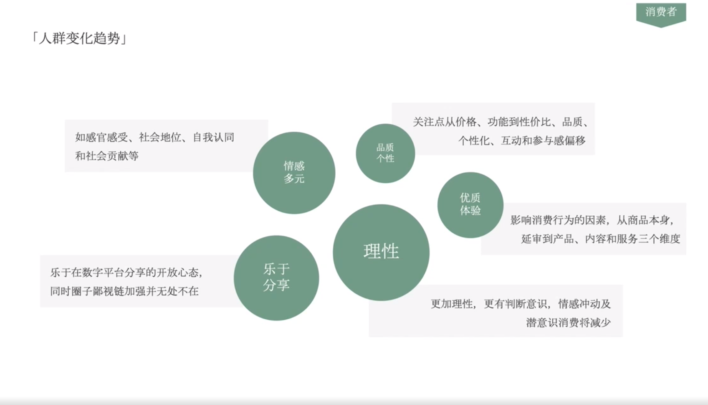

# Slide 26 · 「人群变化趋势」

## 页面图片

## 图片 OCR 文本

「人群变化趋势」
如感官感受、社会地位、自我认同
和社会贡献等
乐于在数字平台分享的开放心态，
同时圈子鄙视链加强并无处不在
情感
多元
乐于
分享
品质
个性
理性
消费者
关注点从价格、功能到性价比、品质、
个性化、互动和参与感偏移
优质
体验
影响消费行为的因素，从商品本身，
延审到产品、内容和服务三个维度
更加理性，更有判断意识，情感冲动及
潜意识消费将减少
