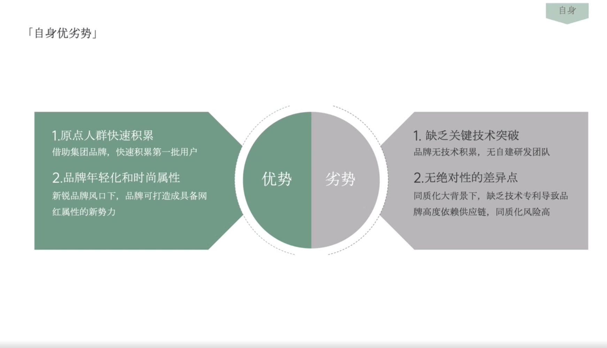

# Slide 27 · 「自身优劣势」

## 页面图片

## 图片 OCR 文本

「自身优劣势」
1.原点人群快速积累
借助集团品牌，快速积累第一批用户
2.品牌年轻化和时尚属性
新锐品牌风口下，品牌可打造成具备网
红属性的新势力
优势
劣势
自身
1. 缺乏关键技术突破
品牌无技术积累，无自建研发团队
2.无绝对性的差异点
同质化大背景下，缺乏技术专利导致品
牌高度依赖供应链，同质化风险高
