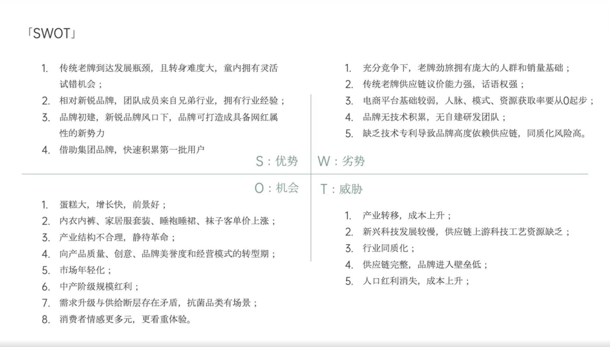

# Slide 28 · 「SWOT」

## 页面图片

## 图片 OCR 文本

「SWOT」
1. 传统老牌到达发展瓶颈，且转身难度大，童内拥有灵活
试错机会；
2. 相对新锐品牌，团队成员来自兄弟行业，拥有行业经验；
3. 品牌初建，新锐品牌风口下，品牌可打造成具备网红属
性的新势力
4.借助集团品牌，快速积累第一批用户
S：优势
0：机会
1. 蛋糕大，增长快，前景好；
2. 内衣内裤、家居服套装、睡袍睡裙、袜子客单价上涨；
3. 产业结构不合理，静待革命；
4. 向产品质量、创意、品牌美誉度和经营模式的转型期；
5. 市场年轻化；
6. 中产阶级规模红利；
7. 需求升级与供给断层存在矛盾，抗菌品类有场景；
8. 消费者情感更多元，更看重体验。
1. 充分竞争下，老牌劲旅拥有庞大的人群和销量基础；
2. 传统老牌供应链议价能力强，话语权强；
3. 电商平台基础较弱，人脉、模式、资源获取率要从O起步；
4. 品牌无技术积累，无自建研发团队；
5. 缺乏技术专利导致品牌高度依赖供应链，同质化风险高。
W：劣势
T：威胁
1. 产业转移，成本上升；
2. 新兴科技发展较慢，供应链上游科技工艺资源缺乏；
3． 行业同质化；
4. 供应链完整，品牌进入壁垒低；
5. 人口红利消失，成本上升；
