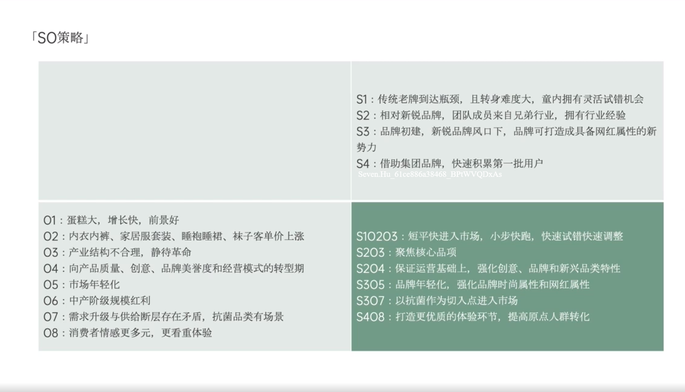

# Slide 29 · 「SO策略」

## 页面图片

## 图片 OCR 文本

「SO策略」
01：蛋糕大，增长快，前景好
02：内衣内裤、家居服套装、睡袍睡裙、袜子客单价上涨
03：产业结构不合理，静待革命
04：向产品质量、创意、品牌美誉度和经营模式的转型期
05：市场年轻化
06：中产阶级规模红利
07：需求升级与供给断层存在矛盾，抗菌品类有场景
08：消费者情感更多元，更看重体验
S1：传统老牌到达瓶颈，且转身难度大，童内拥有灵活试错机会
S2：相对新锐品牌，团队成员来自兄弟行业，拥有行业经验
S3：品牌初建，新锐品牌风口下，品牌可打造成具备网红属性的新
势力
S4：借助集团品牌，快速积累第一批用户
S10203：短平快进入市场，小步快跑，快速试错快速调整
S203：聚焦核心品项
S204：保证运营基础上，强化创意、品牌和新兴品类特性
S305：品牌年轻化，强化品牌时尚属性和网红属性
S307：以抗菌作为切入点进入市场
S408：打造更优质的体验环节，提高原点人群转化
