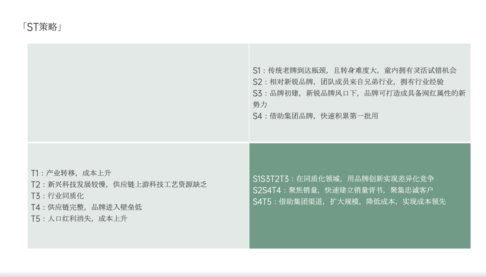

# Slide 30 · 「ST策略」

## 页面图片

## 图片 OCR 文本

「ST策略」
S1：传统老牌到达瓶颈，且转身难度大，童内拥有灵活试错机会
S2：相对新锐品牌，团队成员来自兄弟行业，拥有行业经验
S3：品牌初建，新锐品牌风口下，品牌可打造成具备网红属性的新
势力
S4：借助集团品牌，快速积累第一批用
T1：产业转移，成本上升
T2：新兴科技发展较慢，供应链上游科技工艺资源缺乏
T3：行业同质化
T4：供应链完整，品牌进入壁垒低
T5：人口红利消失，成本上升
SIS3T2T3：在同质化领域，用品牌创新实现差异化竞争
S2S4T4：聚焦销量，快速建立销量背书，聚集忠诚客户
S4T5：借助集团渠道，扩大规模，降低成本，实现成本领先
