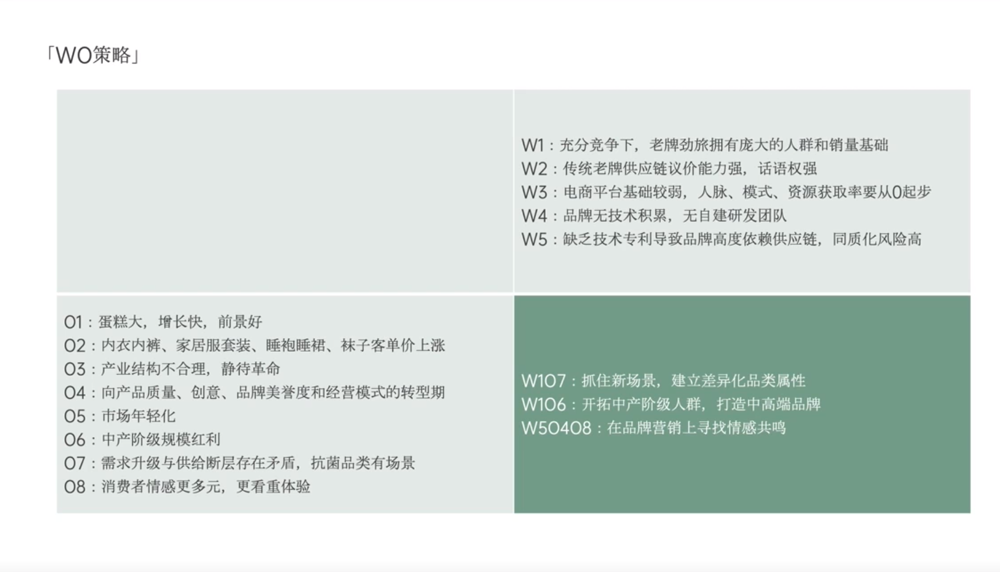

# Slide 31 · 「WO策略」

## 页面图片

## 图片 OCR 文本

「WO策略」
01：蛋糕大，增长快，前景好
02：内衣内裤、家居服套装、睡袍睡裙、袜子客单价上涨
03：产业结构不合理，静待革命
04：向产品质量、创意、品牌美誉度和经营模式的转型期
05：市场年轻化
06：中产阶级规模红利
07：需求升级与供给断层存在矛盾，抗菌品类有场景
08：消费者情感更多元，更看重体验
W1：充分竞争下，老牌劲旅拥有庞大的人群和销量基础
W2：传统老牌供应链议价能力强，话语权强
W3：电商平台基础较弱，人脉、模式、资源获取率要从O起步
W4：品牌无技术积累，无自建研发团队
W5：缺乏技术专利导致品牌高度依赖供应链，同质化风险高
W107：抓住新场景，建立差异化品类属性
W106：开拓中产阶级人群，打造中高端品牌
W50408：在品牌营销上寻找情感共鸣
