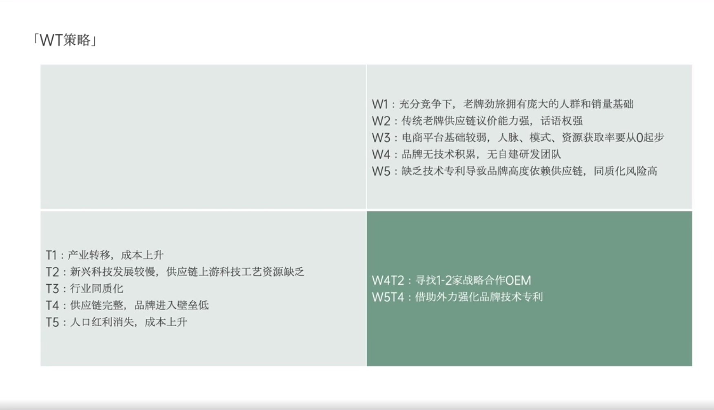

# Slide 32 · 「WT策略」

## 页面图片

## 图片 OCR 文本

「WT策略」
W1：充分竞争下，老牌劲旅拥有庞大的人群和销量基础
W2：传统老牌供应链议价能力强，话语权强
W3：电商平台基础较弱，人脉、模式、资源获取率要从O起步
W4：品牌无技术积累，无自建研发团队
W5：缺乏技术专利导致品牌高度依赖供应链，同质化风险高
T1：产业转移，成本上升
T2：新兴科技发展较慢，供应链上游科技工艺资源缺乏
T3：行业同质化
T4：供应链完整，品牌进入壁垒低
T5：人口红利消失，成本上升
W4T2：寻找1-2家战略合作OEM
W5T4：借助外力强化品牌技术专利
