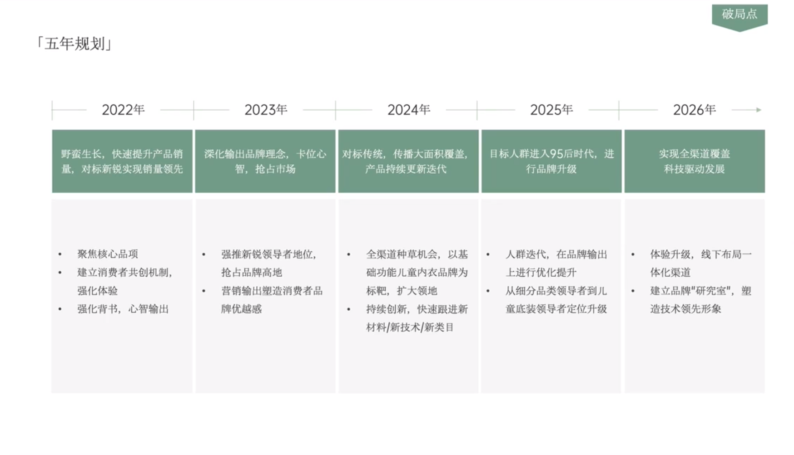

# Slide 37 · 「五年规划」

## 页面图片

## 图片 OCR 文本

「五年规划」
2022年
野蛮生长，快速提升产品销
量，对标新锐实现销量领先
• 聚焦核心品项
• 建立消费者共创机制，
强化体验
• 强化背书，心智输出
2023年
深化输出品牌理念，卡位心
智，抢占市场
• 强推新锐领导者地位，
抢占品牌高地
•
营销输出塑造消费者品
牌优越感
破局点
2024年
2025年
2026年
对标传统，传播大面积覆盖，
产品持续更新迭代
目标人群进入95后时代，进
行品牌升级
实现全渠道覆盖
科技驱动发展
• 全渠道种草机会，以基• 人群迭代，在品牌输出
础功能儿童内衣品牌为
上进行优化提升
标靶，扩大领地
• 从细分品类领导者到儿
• 持续创新，快速跟进新
童底装领导者定位升级
材料/新技术/新类目
• 体验升级，线下布局一
体化渠道
• 建立品牌"研究室"，塑
造技术领先形象
