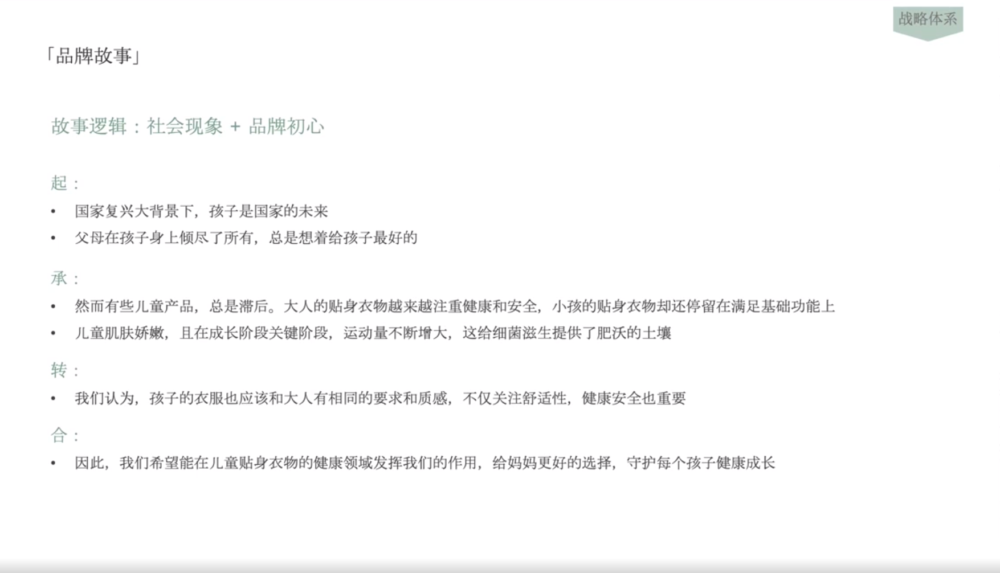

# Slide 45 · 战略体系

## 页面图片

## 图片 OCR 文本

战略体系
「品牌故事」
故事逻辑：社会现象＋品牌初心
起：
• 国家复兴大背景下，孩子是国家的未来
• 父母在孩子身上倾尽了所有，总是想着给孩子最好的
承：
• 然而有些儿童产品，总是滞后。大人的贴身衣物越来越注重健康和安全，小孩的贴身衣物却还停留在满足基础功能上
• 儿童肌肤娇嫩，且在成长阶段关键阶段，运动量不断增大，这给细菌滋生提供了肥沃的土壤
转：
• 我们认为，孩子的衣服也应该和大人有相同的要求和质感，不仅关注舒适性，健康安全也重要
合：
• 因此，我们希望能在儿童贴身衣物的健康领域发挥我们的作用，给妈妈更好的选择，守护每个孩子健康成长
