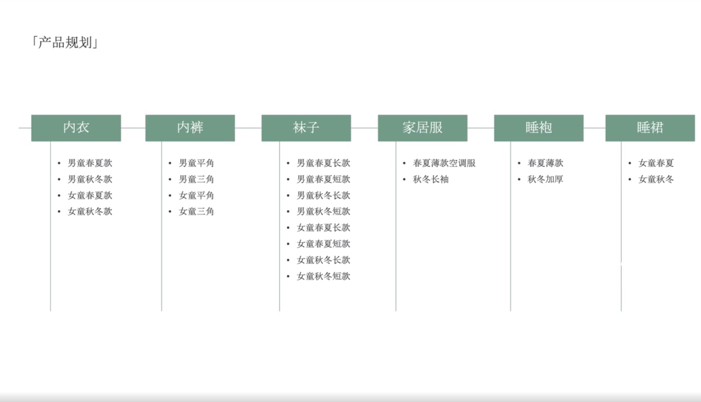

# Slide 58 · 「产品规划」

## 页面图片

## 图片 OCR 文本

「产品规划」
内衣
• 男童春夏款
• 男童秋冬款
• 女童春夏款
• 女童秋冬款
内裤
• 男童平角
•男童三角
•女童平角
• 女童三角
袜子
• 男童春夏长款
• 男童春夏短款
• 男童秋冬长款
• 男童秋冬短款
• 女童春夏长款
• 女童春夏短款
• 女童秋冬长款
• 女童秋冬短款
家居服
• 春夏薄款空调服
• 秋冬长袖
睡袍
• 春夏薄款
• 秋冬加厚
睡裙
• 女童春夏
• 女童秋冬
