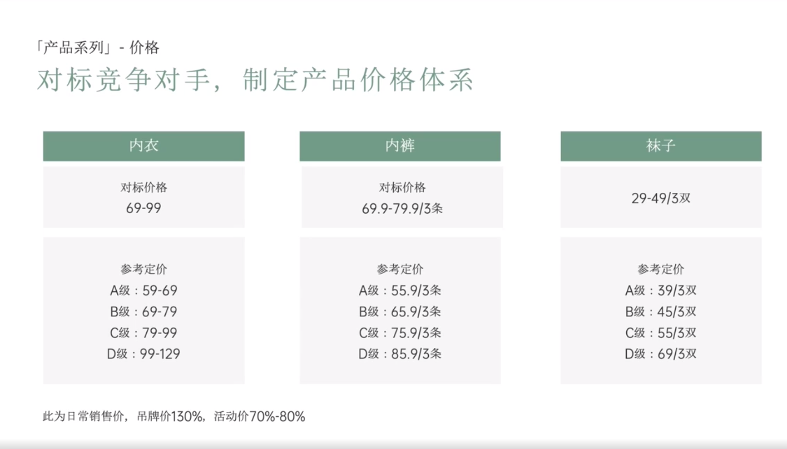

# Slide 61 · 「产品系列」-价格

## 页面图片

## 图片 OCR 文本

「产品系列」-价格
对标竞争对手，制定产品价格体系
内衣
对标价格
69-99
内裤
对标价格
69.9-79.9/3条
参考定价
A级：59-69
B级：69-79
C级：79-99
D级：99-129
参考定价
A级：55.9/3条
B级：65.9/3条
C级：75.9/3条
D级：85.9/3条
此为日常销售价，吊牌价130%，活动价70%-80%
袜子
29-49/3双
参考定价
A级：39/3双
B级：45/3双
C级：55/3双
D级：69/3双
