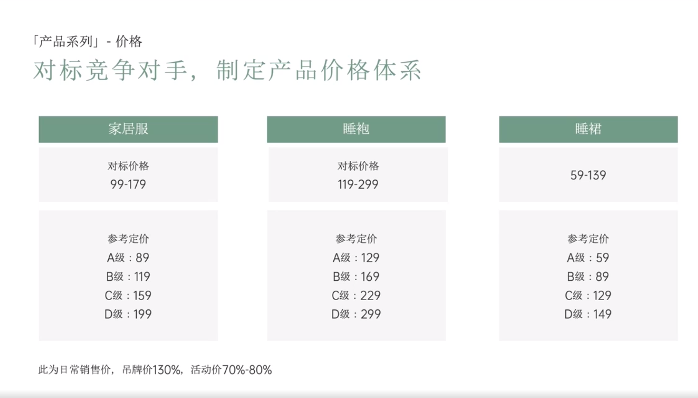

# Slide 62 · 「产品系列」-价格

## 页面图片

## 图片 OCR 文本

「产品系列」-价格
对标竞争对手，制定产品价格体系
家居服
对标价格
99-179
睡袍
对标价格
119-299
参考定价
A级：89
B级：119
C级：159
D级：199
参考定价
A级：129
B级：169
C级：229
D级：299
此为日常销售价，吊牌价130%，活动价70%-80%
睡裙
59-139
参考定价
A级：59
B级：89
C级：129
D级：149
