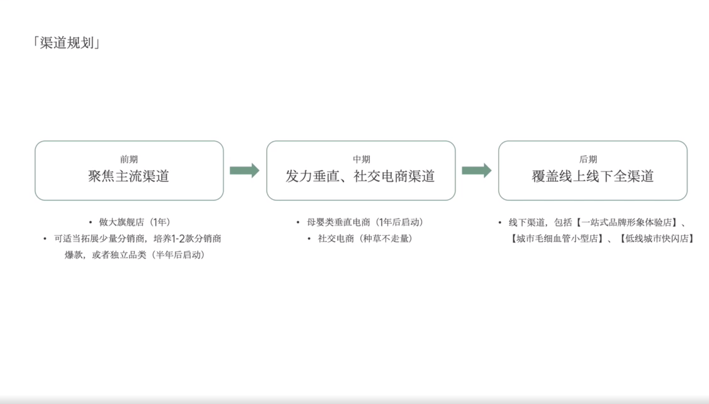

# Slide 65 · 「渠道规划J

## 页面图片

## 图片 OCR 文本

「渠道规划J
前期
聚焦主流渠道
• 做大旗舰店（1年）
• 可适当拓展少量分销商，培养1-2款分销商
爆款，或者独立品类（半年后启动）
中期
发力垂直、社交电商渠道
• 母婴类垂直电商（1年后启动）
• 社交电商（种草不走量）
后期
覆盖线上线下全渠道
•线下渠道，包括【一站式品牌形象体验店】、
【城市毛细血管小型店】、【低线城市快闪店】
