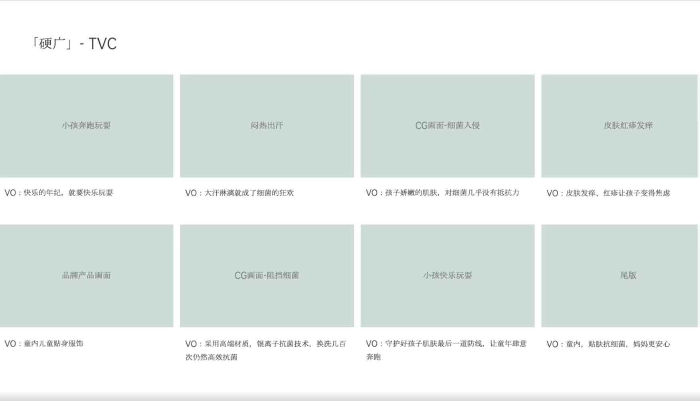

# Slide 67 · 「硬广」- TVC

## 页面图片

## 图片 OCR 文本

「硬广」- TVC
小孩奔跑玩耍
VO：快乐的年纪，就要快乐玩耍
品牌产品画面
VO：童内儿童贴身服饰
闷热出汗
CG画面-细菌入侵
皮肤红疹发痒
VO：大汗淋漓就成了细菌的狂欢
VO：孩子娇嫩的肌肤，对细菌几乎没有抵抗力
VO：皮肤发痒、红疹让孩子变得焦虑
CG画面-阻挡细菌
小孩快乐玩耍
尾版
VO：采用高端材质，银离子抗菌技术，换洗几百
次仍然高效抗菌
VO：守护好孩子肌肤最后一道防线，让童年肆意
奔跑
VO：童内，贴肤抗细菌，妈妈更安心
