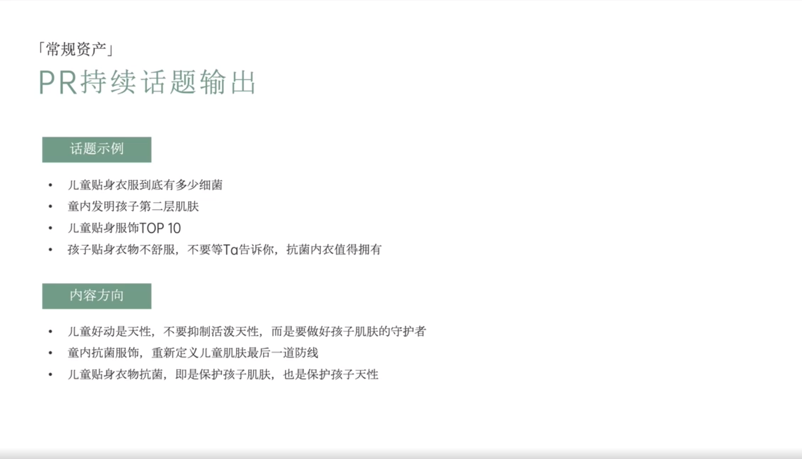

# Slide 76 · 「常规资产」

## 页面图片

## 图片 OCR 文本

「常规资产」
PR持续话题输出
话题示例
• 儿童贴身衣服到底有多少细菌
• 童内发明孩子第二层肌肤
• 儿童贴身服饰TOP 10
• 孩子贴身衣物不舒服，不要等Ta告诉你，抗菌内衣值得拥有
内容方向
• 儿童好动是天性，不要抑制活泼天性，而是要做好孩子肌肤的守护者
• 童内抗菌服饰，重新定义儿童肌肤最后一道防线
• 儿童贴身衣物抗菌，即是保护孩子肌肤，也是保护孩子天性
