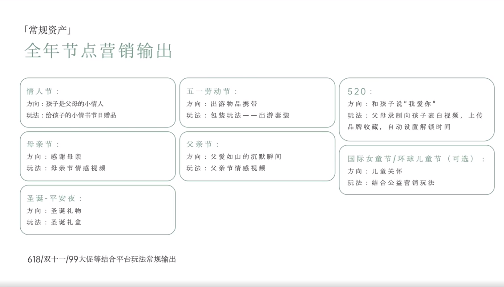

# Slide 78 · 「常规资产」

## 页面图片

## 图片 OCR 文本

「常规资产」
全年节点营销输出
情人节：
方向：孩子是父母的小情人
玩法：给孩子的小情书节日赠品
五一劳动节：
方向：出游物品携带
玩法：包装玩法一一出游套装
母亲节：
方向：感谢母亲
玩法：母亲节情感视频
父亲节：
方向：父爱如山的沉默瞬间
玩法：父亲节情感视频
圣诞-平安夜：
方向：圣诞礼物
玩法：圣诞礼盒
618/双十一199大促等结合平台玩法常规输出
520：
方向：和孩子说"我爱你"
玩法：父母录制向孩子表白视频，上传
品牌收藏，自动设置解锁时间
国际女童节/环球儿童节（可选）：
方向：儿童关怀
玩法：结合公益营销玩法
