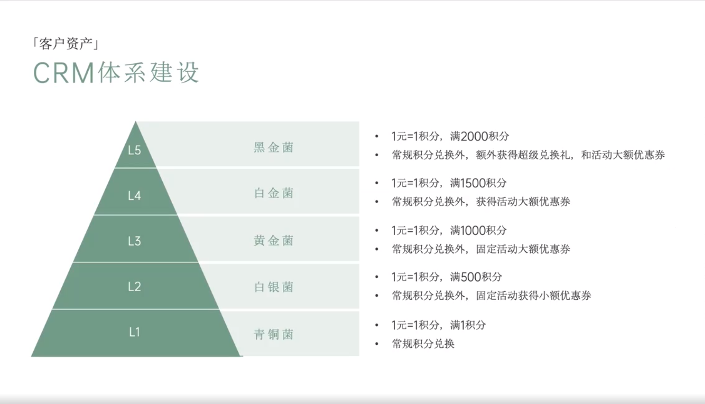

# Slide 79 · 「客户资产」

## 页面图片

## 图片 OCR 文本

「客户资产」
CRM体系建设
L5
L4
L3
L2
L1
黑金菌
白金菌
黄金菌
白银菌
青铜菌
• 1元=1积分，满2000积分
• 常规积分兑换外，额外获得超级兑换礼，和活动大额优惠券
• 1元=1积分，满1500积分
• 常规积分兑换外，获得活动大额优惠券
• 1元=1积分，满1000积分
• 常规积分兑换外，固定活动大额优惠券
• 1元=1积分，满500积分
• 常规积分兑换外，固定活动获得小额优惠券
• 1元=1积分，满1积分
• 常规积分兑换
