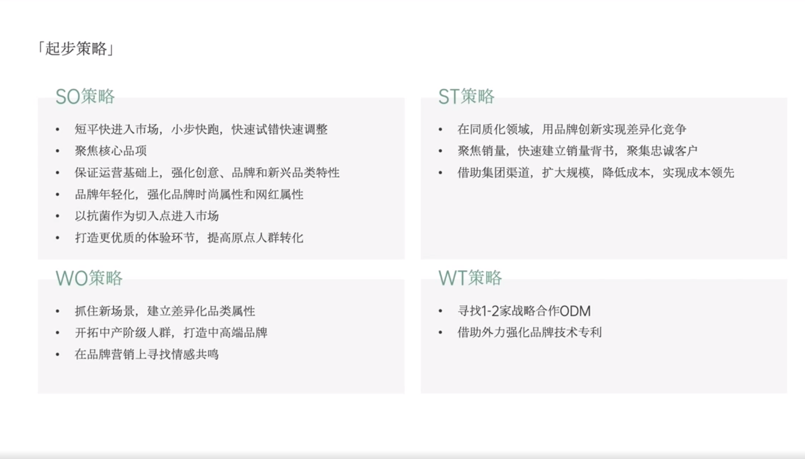

# Slide 88 · 「起步策略」

## 页面图片

## 图片 OCR 文本

「起步策略」
SO策略
• 短平快进入市场，小步快跑，快速试错快速调整
• 聚焦核心品项
• 保证运营基础上，强化创意、品牌和新兴品类特性
• 品牌年轻化，强化品牌时尚属性和网红属性
• 以抗菌作为切入点进入市场
• 打造更优质的体验环节，提高原点人群转化
WO策略
• 抓住新场景，建立差异化品类属性
• 开拓中产阶级人群，打造中高端品牌
• 在品牌营销上寻找情感共鸣
ST策略
• 在同质化领域，用品牌创新实现差异化竞争
• 聚焦销量，快速建立销量背书，聚集忠诚客户
• 借助集团渠道，扩大规模，降低成本，实现成本领先
WT策略
• 寻找1-2家战略合作ODM
• 借助外力强化品牌技术专利
