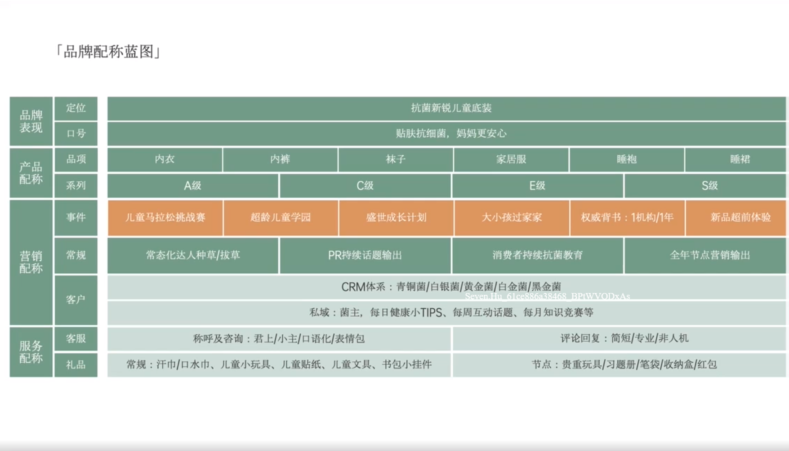

# Slide 93 · 品牌

## 页面图片

## 图片 OCR 文本

品牌
表现
产品
配称
「品牌配称蓝图」
定位
口号
品项
系列
事件
抗菌新锐儿童底装
贴肤抗细菌，妈妈更安心
内衣
内裤
袜子
家居服
睡袍
睡裙
A级
儿童马拉松挑战赛
C级
超龄儿童学园
盛世成长计划
E级
大小孩过家家
权威背书：1机构/1年
S级
新品超前体验
营销
配称
服务
配称
常规
客户
客服
礼品
常态化达人种草/拔草
PR持续话题输出
消费者持续抗菌教育
全年节点营销输出
CRM体系：青铜菌/白银菌/黄金菌/白金菌/黑金菌
6ce886a68468 MODxAS
私域：菌主，每日健康小TIPS、每周互动话题、每月知识竞赛等
称呼及咨询：君上/小主/口语化/表情包
常规：汗巾/口水巾、儿童小玩具、儿童贴纸、儿童文具、书包小挂件
评论回复：简短/专业/非人机
节点：贵重玩具/习题册/笔袋/收纳盒/红包
