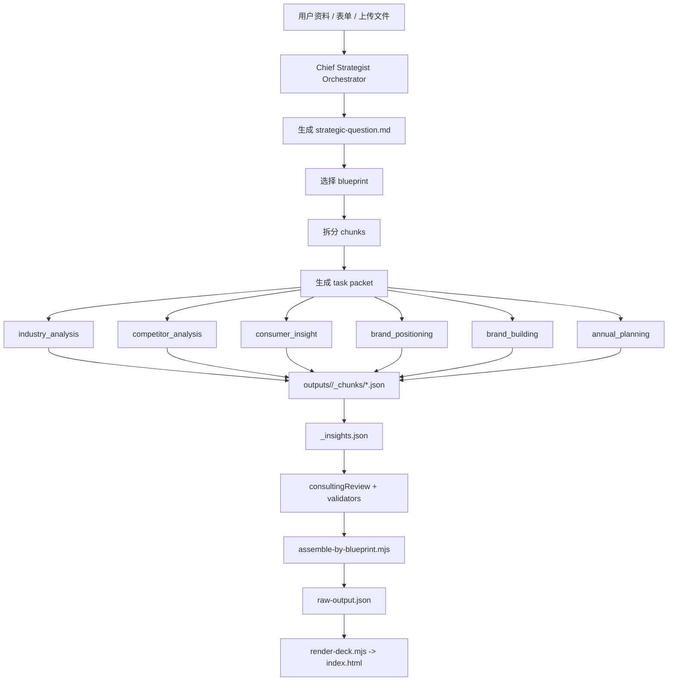

# Chief Strategist Orchestrator Architecture

日期: 2026-05-28  
状态: 已接入本地 blueprint flow  
目标: 把 PPTAgent 从“脚本串联”升级为“主 Agent 中枢 + 专项子 Agent 协作”的品牌策略系统。

## 1. 设计结论

PPTAgent 的正确协作模型不是“6 个 Sub-Agent 各写一份小方案, 然后拼起来”, 而是:

1. 主 Agent 先接收资料、澄清需求、定义根问题。
2. 主 Agent 根据方案类型选择 blueprint。
3. 主 Agent 把 blueprint 拆成 chunk 任务包。
4. 每个 Sub-Agent 只负责自己 chunk 的局部策略判断。
5. Sub-Agent 把 `chunk_takeaway` / `chunk_insights` / `thinking_log` / `slides` 回传给主 Agent。
6. 主 Agent 做证据核查、冲突核查、叙事汇总和最终组装。

一句话: **主 Agent 控制整案逻辑, Sub-Agent 负责局部判断。**

## 2. 角色分工

### 主 Agent: `chief_strategist`

职责:

- 需求澄清
- 根问题定义
- 方案类型判断
- blueprint 选择
- chunk 任务派发
- 上下文裁剪
- 上游结论传递
- 证据核查
- 逻辑冲突核查
- 整案汇总
- 触发 render 和最终质量检查

主 Agent 不应该亲自写所有页, 它负责“像项目负责人一样组织判断”。

### 子 Agent

| Agent | 角色 | 典型 chunk |
|---|---|---|
| `industry_analysis` | 行业分析师 | 市场扫描、赛道窗口、行业周期 |
| `competitor_analysis` | 竞争分析师 | 竞品格局、心智地图、竞争空位 |
| `consumer_insight` | 消费者洞察师 | 人群画像、JTBD、痛点收益 |
| `brand_positioning` | 品牌定位策略师 | 自身分析、定位语句、品牌屋 |
| `brand_building` | 品牌建设策略师 | 品牌系统、VI brief、产品/渠道/传播配称 |
| `annual_planning` | 年度规划策略师 | 年度节奏、营销日历、OKR |

子 Agent 的任务边界:

- 不自由决定页数。
- 不自由改方案结构。
- 不引入 blueprint 未允许的方法论。
- 不忽略上游 chunk 结论。
- 不伪造证据。
- 输出必须回传给主 Agent 汇总。

## 3. 上下文分层

主 Agent 把上下文拆成 4 层, 按需发给子 Agent。

### 3.1 Global Context

所有 Agent 都应该知道的项目基础事实:

- 客户名
- 行业
- 品牌阶段
- 目标人群
- 核心产品
- 主要竞品
- 方案类型
- 根问题

### 3.2 Evidence Context

证据来源层:

- `inputs/<slug>/form.json`
- `inputs/<slug>/summary.md`
- `inputs/<slug>/strategic-question.md`
- 用户上传资料
- case library
- web_search 结果
- 上游 chunk 的 data_refs

原则: 所有结论都应该能回到 evidence context。

### 3.3 Blueprint Context

方案骨架层:

- blueprint id
- part
- chunk id
- chunk intent
- page range
- 每页 page_intent
- recommended_layout
- allowed_concepts
- required_inputs
- upstream_chunks

原则: 子 Agent 只填 blueprint 要它填的那一段。

### 3.4 Working Memory

工作记忆层:

- 上游 chunk ids
- 上游 `chunk_takeaway`
- 上游 `chunk_insights`
- 上游关键 action titles
- 缺失上游时的 missing 标记

原则: 下游只读取相关上游摘要, 不读取整份历史长上下文。

## 4. Task Packet 通信协议

主 Agent 向子 Agent 派发任务时, 注入 `chief-strategist-task-packet/v1`。

当前实现文件:

- `scripts/chief-strategist-orchestrator.mjs`
- `scripts/run-sub-agent.mjs`

核心字段:

```json
{
  "schema_version": "chief-strategist-task-packet/v1",
  "orchestrator": {
    "role": "chief_strategist",
    "responsibilities": ["需求澄清", "根问题定义", "任务派发", "证据核查", "整案汇总"]
  },
  "agent_id": "consumer_insight",
  "chunk_id": "p2-c3-consumer-portraits",
  "task": {
    "title": "消费者画像 4 页",
    "intent": "目标人群分层 + 5W2H 画像",
    "must_answer": "这段必须回答的核心战略问题",
    "expected_insights_count": 3,
    "feeds_into": ["p2-c4-consumer-mindset"]
  },
  "context_layers": {
    "global_context": {},
    "evidence_context": {},
    "blueprint_context": {},
    "working_memory": {}
  },
  "output_contract": {
    "required_fields": ["chunk_takeaway", "chunk_insights", "thinking_log", "slides"],
    "handoff_back_to_orchestrator": ["chunk_takeaway", "chunk_insights", "assumptions", "data_refs"]
  },
  "quality_gates": ["blueprintCheck", "contentCheck", "methodologyCheck", "consultingReview", "assembleByBlueprint"]
}
```

`run-sub-agent.mjs` 会把它注入 prompt bundle:

```md
## Orchestrator Task Packet (auto-injected)
```

## 5. 运行链路



## 6. 汇总和核查逻辑

主 Agent 在汇总时要检查:

1. 每个 chunk 是否回答了自己的 `must_answer`。
2. 每个 chunk 是否有非空 `chunk_takeaway`。
3. 下游 chunk 是否引用了上游 chunk 的关键结论。
4. 行业、竞品、消费者、自身分析是否能共同推出定位, 而不是互不相关。
5. `data_refs` 是否真实。
6. `models_used` 是否在 allowed_concepts 内。
7. `slides.length` 是否等于 blueprint chunk 页数。
8. 整案 `chunk_takeaway` 连起来是否是一条完整提案逻辑。

## 7. 与现有 Blueprint Flow 的关系

现有 flow 已经完成:

- blueprint 定义结构。
- `run-blueprint-suite.mjs` 顺序准备 chunk。
- `run-sub-agent.mjs` 生成 prompt bundle。
- `assemble-by-blueprint.mjs` 集中组装。

本次新增的是:

- 主 Agent task packet。
- 上下文分层协议。
- 子 Agent 回传契约。
- prompt bundle 中明确注入 Orchestrator 身份和任务边界。

这让系统从“蓝图脚本”进一步接近“真实多 Agent 协作系统”。

## 8. 后续接 Web App 的原则

Web App 不应该让前端自由拼方案结构。

推荐流程:

1. 用户填表 / 上传资料。
2. 后端生成 project。
3. 主 Agent 判断 `scheme_type`。
4. 后端加载固定 blueprint。
5. 主 Agent 生成 task packets。
6. Worker 队列按 chunk 调用子 Agent。
7. 每个 chunk 完成后进入 review。
8. 全部通过后 assemble + render。

数据库建议表:

- `projects`
- `project_inputs`
- `runs`
- `agent_tasks`
- `agent_task_packets`
- `chunk_outputs`
- `chunk_reviews`
- `deck_outputs`

## 9. 当前边界

- 当前已实现 task packet 生成和 prompt 注入。
- 当前本地 demo generator 仍是 deterministic demo。
- 真实生产版还需把 LLM 调用接入 `run-blueprint-suite.mjs`。
- `consultingReview` 当前是规则型, 后续可升级为 LLM stress-test + retry。
- render 层客户级精雕仍在后续 render upgrade。

